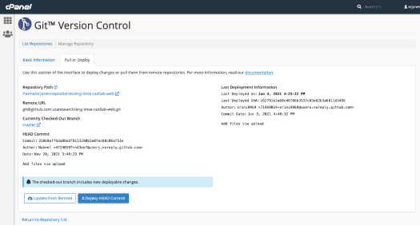

# Deploy Instructions

To deploy code changes, press the "Deploy HEAD Commit" button on the "Pull or Deploy" tab of the "Git™ Version Control" screen in the CPanel.
https://rfid.uta.edu/cpanel

The username is **ecjones**. The password is local to the server and not linked to a NetID. If you need the password reset, OIT WHS can help with that by submitting a ticket via https://ithelp.uta.edu

